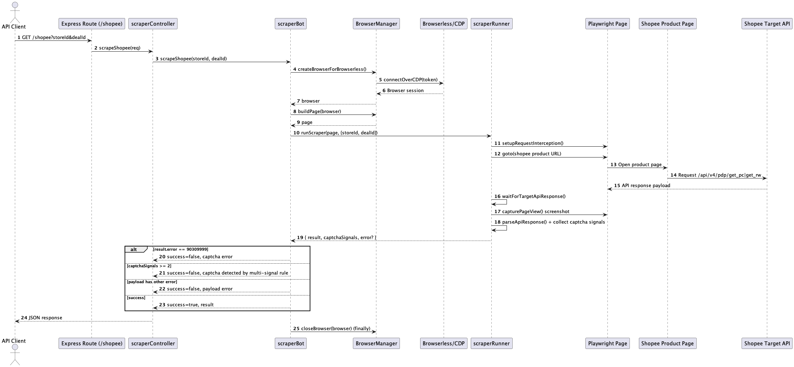

# Shopee Scraper API

Express + TypeScript API to scrape Shopee product payloads using Playwright and Browserless.

## Prerequisites

- Node.js `>=22`
- npm (or pnpm)
- Browserless API token
- Ngrok account (for public testing)

## Project Setup

1. Install dependencies:

```bash
npm install
```

2. Create `.env` at the project root:

```env
NODE_ENV=development
NAVIGATION_TIMEOUT=30000
SHOPEE_BASE_URL=https://shopee.tw
USER_AGENT=Mozilla/5.0 (Windows NT 10.0; Win64; x64) AppleWebKit/537.36 (KHTML, like Gecko) Chrome/144.0.0.0 Safari/537.36
BROWSERLESS_SERVICE_URL=https://production-sfo.browserless.io/chrome/bql
BROWSERLESS_API_TOKEN=YOUR_BROWSERLESS_API_TOKEN
```

Notes:
- Server port is currently hardcoded to `3000` in `src/index.ts`.
- Screenshots are saved into `logs/screenshots/`.

## Run Locally

```bash
npm start
```

This compiles TypeScript and starts the server at:

`http://localhost:3000`

## Expose Public URL with Ngrok

1. Install Ngrok:

```bash
brew install ngrok/ngrok/ngrok
```

2. Add your auth token:

```bash
ngrok config add-authtoken <YOUR_NGROK_AUTHTOKEN>
```

3. Start tunnel to local API:

```bash
ngrok http 3000
```

4. Copy the HTTPS forwarding URL from terminal, for example:

`https://abc123.ngrok-free.app`

## API Usage

### Health Check

- Method: `GET`
- Endpoint: `/health`

Local:

```bash
curl -i http://localhost:3000/health
```

Ngrok:

```bash
curl -i https://abc123.ngrok-free.app/health
```

### Scrape Shopee Product

- Method: `GET`
- Endpoint: `/shopee`
- Query params: `storeId`, `dealId`

Local:

```bash
curl "http://localhost:3000/shopee?storeId=178926468&dealId=21448123549"
```

Ngrok:

```bash
curl "https://abc123.ngrok-free.app/shopee?storeId=178926468&dealId=21448123549"
```

Success response shape:

```json
{
  "success": true,
  "result": {
    "error": null,
    "error_msg": null,
    "data": {
      "item": {}
    }
  }
}
```

Failure response shape:

```json
{
  "success": false,
  "error": "Shopee returned a captcha error."
}
```

## Share with Testers

After `ngrok http 3000` is running, share:

1. Base URL: `https://abc123.ngrok-free.app`
2. Health URL: `https://abc123.ngrok-free.app/health`
3. Scrape URL template: `https://abc123.ngrok-free.app/shopee?storeId=<STORE_ID>&dealId=<DEAL_ID>`

## Scripts

- `npm run build`: compile TypeScript into `dist/`
- `npm start`: build and run API

## Project Structure

```text
src/
  index.ts
  api/
    controller/
      shopee.scrapercontroller.ts
    routes/
      index.ts
  botAutomator/
    scraperbot.ts
    scraperRunner.ts
  configurations/
    index.ts
  types/
    index.ts
  utils/
    BrowserManager.ts
docs/
  scrape-sequence-diagram.md
  scrape-sequence-diagram.puml
out/
  docs/
    scrape-sequence-diagram/
      scrape-sequence-diagram.png
```

## Sequence Diagram



## Troubleshooting

- `Missing Browserless token`: ensure `BROWSERLESS_API_TOKEN` is set in `.env`.
- Ngrok tunnel not accessible: ensure `ngrok http 3000` is running and you copied the HTTPS URL.
- Empty scrape result or timeout: retry with a valid `storeId` / `dealId` and confirm Shopee page is accessible.
